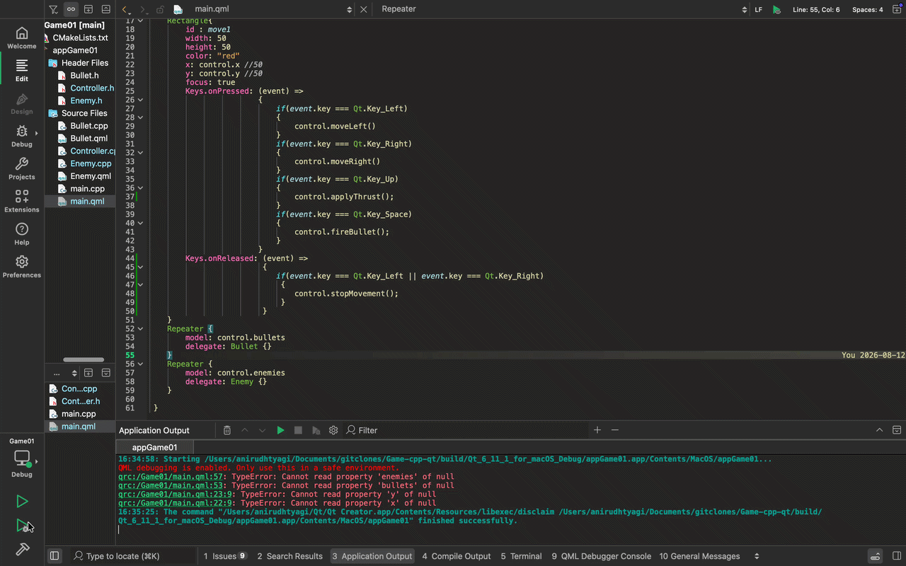
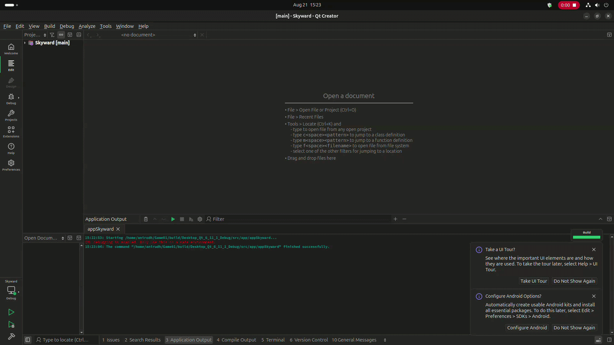

# Skyward

A 2D arcade-style game built with C++ and Qt Quick (QML), demonstrating embedded-style game-loop architecture, C++/QML data binding, and object lifecycle management on the Qt Quick scene graph.

## Overview

Skyward is a small unhurried shooter. You fly a rocket along the bottom of a night sky, drifting left and right, thrusting up against gravity, and firing at enemies that drop in at randomized intervals. Let one reach the ground, or let one reach you, and the run is over.

The project is structured to separate simulation logic (C++) from presentation (QML), using Qt's property and signal/slot system as the binding layer between the two.

## Showcase

<table width="100%">
<tr>
<th align="center">Early prototype</th>
<th align="center">Current build</th>
</tr>
<tr>
<td width="50%"></td>
<td width="50%"></td>
</tr>
</table>

## Architecture

The build is split into three targets, one per layer:

| Target | Location | Responsibility |
|--------|----------|----------------|
| `game_core` | `src/core/` | Simulation: game loop, physics, collision, entity lifetimes. No UI or QML file knowledge. |
| `game_ui` | `src/ui/` | The `Skyward` QML module: window, views, HUD, theme. No game state. |
| `appSkyward` | `src/app/` | Thin executable that constructs the controller, exposes it to the engine, and loads the QML module. |

### Simulation (`src/core`)

- **`Controller`** — Central game-state owner. Drives the fixed-timestep update loop (`QTimer`, ~60 FPS), tracks player position and physics (gravity, thrust), resolves bullet/enemy collisions through a uniform grid, and manages the lifetime of `Bullet` and `Enemy` instances via `QQmlListProperty`.
- **`Bullet`** — A fired projectile with independent position updates and a destruction signal consumed by the `Controller` for cleanup.
- **`Enemy`** — A spawned enemy entity with its own position state, instantiated on a jittered timer interval.
- **`GameConfig.h`** — Every simulation tunable (entity sizes, speeds, timings, scoring, difficulty ramp) in one header.
- **`Config`** — A read-only window onto the entity sizes in `GameConfig.h`, exposed to QML so the view draws the same boxes collision uses.

The ship flies in a corridor: `updateState()` clamps it against both the floor and a ceiling at `bottomY * ceilingFraction`, zeroing velocity at either end. The ceiling is enforced every frame rather than tested when thrust is pressed, so it cannot be climbed through.

The level is derived from the score (`1 + score / pointsPerLevel`) rather than counted alongside it, so the two cannot drift apart. Each level makes enemies fall faster and spawn closer together; both ramps are clamped, and the speed cap also keeps a falling enemy from stepping clean over the player between two frames.

### Presentation (`src/ui`)

`Main.qml` is the only file that touches the C++ side. It reads the `control` context property and feeds plain values down into view components, so the components below it stay reusable and testable in isolation:

- **`Main.qml`** — Root window, keyboard input forwarding, and all binding to `control`.
- **`Player.qml` / `BulletView.qml` / `EnemyView.qml`** — Passive sprite views, positioned by their parent.
- **`Hud.qml`** — Score and level readout, takes both as properties.
- **`LevelBanner.qml`** — Transient level-up announcement, shown when the caller calls `announce()`.
- **`Starfield.qml`** — Decorative night-sky backdrop, seeded once at creation.
- **`MenuOverlay.qml` / `MenuButton.qml`** — The one page shown before a run, while a run is paused, and after one ends. It holds no game state; the caller supplies the wording and handles the two signals.
- **`Theme.qml`** — Singleton holding colors, fonts, and sprite paths, so no view hard-codes its own look. Entity sizes are *not* decided here; it reads them back from `config`.

This separation keeps simulation state and timing in C++, where memory layout and update cost are predictable, while leaving rendering and input handling declarative in QML.

Keyboard input filters auto-repeat, so movement and fire rate come from the controller's own timer rather than from the reader's keyboard settings, and it tracks both arrows so releasing one while the other is held hands over instead of stopping.

## Benchmarks

`bench/` measures the collision broad phase in `Controller::checkCollision()` against an
exhaustive sweep that tests every bullet against every enemy. Both passes read entity sizes
and the cell size out of `GameConfig.h`, so retuning the game retunes the benchmark with it.

`collision_verify` runs both over 2,000 randomized scenes and compares the full set of
overlapping pairs. Two boxes that overlap must share at least one cell, so the grid cannot
miss a pair, and the check confirms it: 2,000/2,000 identical, across 18,585 overlapping
pairs. The per-frame dedup is switched off for the comparison — with it on, the two passes
visit enemies in a different order, so a bullet can claim a different but equally valid
enemy and the counts drift apart without either side being wrong.

`collision_bench`, release build, Apple M-series, 1280x720 field, entities placed uniformly:

| bullets x enemies | grid | sweep | speedup | AABB tests, grid vs sweep | |
|---|---|---|---|---|---|
| 10 x 12 | 1.9 us | 0.3 us | 0.2x | 4 vs 107 (27x fewer) | typical live play |
| 15 x 25 | 4.2 us | 0.8 us | 0.2x | 7 vs 322 (46x) | |
| 30 x 60 | 9.8 us | 3.3 us | 0.3x | 39 vs 1,378 (35x) | |
| 50 x 100 | 16.8 us | 8.5 us | 0.5x | 72 vs 3,211 (45x) | |
| 100 x 250 | 42.0 us | 34.9 us | 0.8x | 247 vs 11,192 (45x) | sweep still ahead |
| 200 x 500 | 77.5 us | 148.4 us | 1.9x | 653 vs 32,025 (49x) | grid pulls ahead |
| 500 x 1000 | 156.9 us | 972.8 us | 6.2x | 1,704 vs 111,046 (65x) | |
| 1000 x 2000 | 367.0 us | 2,540.9 us | 6.8x | 3,497 vs 250,613 (72x) | stress |

The grid cuts AABB tests by 27-72x at every size, because a bullet only ever tests the
enemies bucketed into the cells its own box touches. Wall-clock time is a different story:
below roughly 150 bullets against 350 enemies the sweep is *faster*, because building a
`QHash` every frame costs more in allocation and pointer chasing than the hundred-odd
tests it saves, and a flat `QList` walk predicts well.

Skyward never gets near that crossover. The spawn floor and the descent-speed cap put
about a dozen enemies on screen at once, where the pass costs ~2 us of a 16 ms frame
budget — about 0.01%, and slower than the sweep would have been. The grid is kept because
it holds its shape as entity counts grow, not because it pays for itself at this size;
`enemyHitPlayer()` deliberately uses a plain sweep instead, since one player box against a
dozen enemies is exactly the case the grid loses.

The benchmark times the algorithm alone. A real frame also pays for `QObject` construction,
signal emission and the QML delegate rebuild, none of which appear here.

To build and run:

```bash
cmake -S . -B build -DCMAKE_PREFIX_PATH=/path/to/Qt/6.x.y/<platform> \
    -DCMAKE_BUILD_TYPE=Release -DSKYWARD_BUILD_BENCH=ON
cmake --build build --target collision_bench collision_verify
./build/bench/collision_verify   # exits non-zero on a mismatch, also runs under ctest
./build/bench/collision_bench
```

## Controls

| Key | Action |
|-----|--------|
| Left Arrow | Move left |
| Right Arrow | Move right |
| Up Arrow | Apply thrust |
| Space | Fire bullet |
| Escape | Pause / resume during a run, quit while the menu is up |
| Enter | Start / restart / resume, while the menu is up |

## Requirements

- Qt 6.5 or later (Qt Quick + Linguist tools)
- CMake 3.21 or later
- A C++17-capable compiler

## Build

```bash
cmake -S . -B build -DCMAKE_PREFIX_PATH=/path/to/Qt/6.x.y/<platform>
cmake --build build
```

Run the resulting binary from `build/src/app/` (`appSkyward.app` on macOS).

To check the QML for errors without running it:

```bash
cmake --build build --target all_qmllint
```

## Project Layout

```
CMakeLists.txt          Top-level build, finds Qt and adds the three targets
                        plus bench/ behind the SKYWARD_BUILD_BENCH option
src/
  core/                 Simulation library (game_core)
    GameConfig.h        Shared tunables: sizes, speeds, timings, scoring
    Config.h            Entity sizes exposed to QML, so the view cannot drift
    Controller.h/.cpp   Game loop, physics, collision, entity lifetimes
    Bullet.h/.cpp       Projectile entity
    Enemy.h/.cpp        Enemy entity
  ui/                   QML module "Skyward" (game_ui)
    Main.qml            Root window, input, and the only binding to C++
    Theme.qml           Singleton: colors, fonts, sprite paths
    Player.qml          Player view
    BulletView.qml      Projectile view delegate
    EnemyView.qml       Enemy view delegate
    Hud.qml             Score and level readout
    LevelBanner.qml     Level-up announcement
    Starfield.qml       Night-sky backdrop
    MenuOverlay.qml     Start / paused / game-over page
    MenuButton.qml      Pill button used by the menu
  app/
    main.cpp            Entry point, engine setup, C++/QML bridge
bench/                  Collision benchmarks, built with -DSKYWARD_BUILD_BENCH=ON
  CollisionBench.cpp    Uniform grid vs exhaustive sweep, timings and test counts
  CollisionVerify.cpp   Checks the grid finds the same pairs as the sweep
assets/
  assets.qrc            Sprites and fonts, compiled into the executable
i18n/
  Skyward_en_IN.ts      Translation source, compiled into the binary at :/i18n
```

## Notes

This is an active learning project exploring Qt/QML application structure, C++ backend integration with QML via `Q_PROPERTY` and `Q_INVOKABLE`, and manual object pooling patterns relevant to resource-constrained and embedded UI development.
